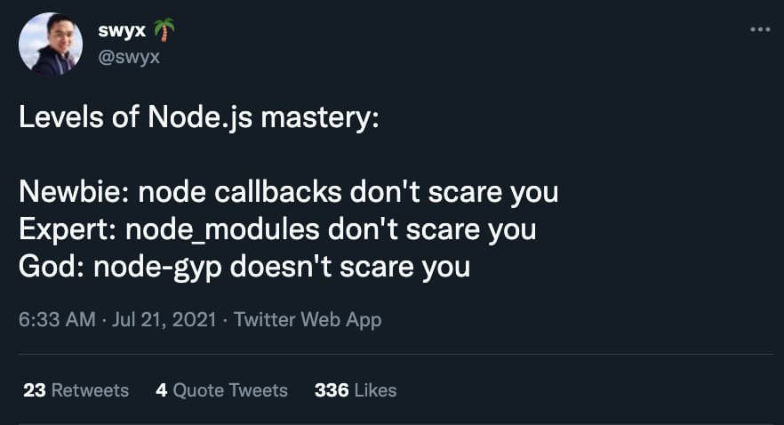
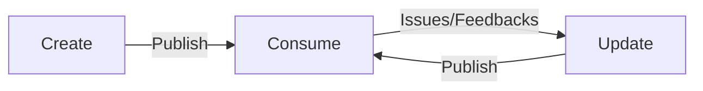

# My npm package setup

---

## Why learn this?

Learn how package creation/publishing works, which would help greatly if you

- interested to contribute/understand open source code on GitHub
- want to level up your JavaScript debugging skill

---

[Start of Demo](https://github.com/malcolm-kee/npm-pkg-setup/tree/start)

---

## Lifecycle of a npm package:

1. Create
1. Consume
1. Update

[Demo: Extracting Package](https://github.com/malcolm-kee/npm-pkg-setup/tree/extract-to-package)

---

## Common pain points

1. Figure out how to publish to certain registry with the right permissions (not covered today)
1. Figure out how to configure the package so it can be consumed easily
1. Figure out how to update and preview package changes with minimal overhead

---

## Configure package

### Choosing a bundler

We need a bundler for the following:

- additional processing like compile from TS to JS + type definitions.
- merge multiple files into single file so it's single entry points, so it's easier to consume
- generate multiple formats (CommonJS + ESM) so we can support multiple environments

My setup:

1. Use [`tsup`](https://tsup.egoist.dev/) if it is good enough for the use case.
1. Use [`rollup`](https://rollupjs.org/guide/en/) if advanced configuration is needed.

### Configure `package.json`

1. For single entry point,

   - `main` for CommonJS/UMD format
   - `module` for ESM format
   - `types` for typescript definition

2. For multiple entry points, use `exports` to define what are the entry points.

[Demo: Adding a bundler](https://github.com/malcolm-kee/npm-pkg-setup/tree/add-package-bundler)

---

## Update and preview package changes

### Use monorepo

1. Use [`pnpm`](https://pnpm.io/) workspace by preview changes by adding a playground/example as another "package" of the workspace.
1. With monorepo, you may not even need to publish package at all!

### Use a local registry

1. Use [`Verdaccio`](https://verdaccio.org/) to preview the behavior without actually publishing it.

[Demo: Using pnpm monorepo](https://github.com/malcolm-kee/npm-pkg-setup/tree/use-pnpm-workspace)
